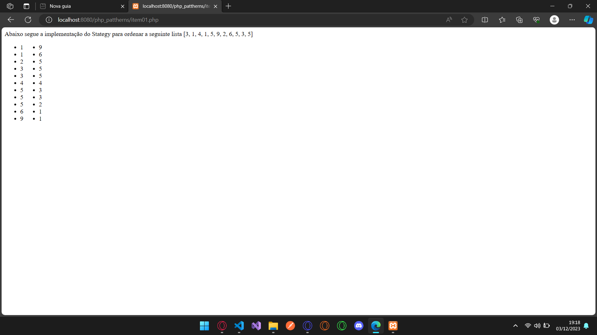

# pattherns
Desenvolvido exemplo de utilização de métodos pattherns
Tela inicial com os métodos

As demais telas vão ter apenas um exemplo simples da ultilização do método selecionado na tela inicial.
Exemplo de um patther a ser exibido.

